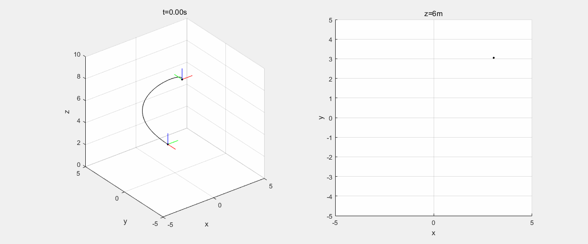
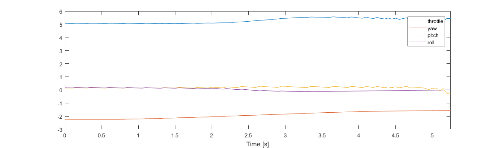

# MAV Real Time Trajectory Generator
An implementation of real-time optimal trajectory generation base on the minimum snap trajectory.
## Objectives
The algorithm is able to perform real-time optimal trajectory planning and compute the corresponding control input. The generated trajectory should be trackable, which means the initial and the final MAV states as well as the limitation of pitch angle should be taken into consideration.

## Basic Structure
Structure contains the position, the orientation and the speed on body frame.
```Matlab
obj.position = [x,y,z];  
obj.angle = [yaw,pitch,roll];
obj.speed = [vx,vy,vz]; % body frame
```
## Simple Dynamic Model
The discrete time dynamic model of MAV.
```Matlab
ts = 0.05; % sampling time is 0.05 s
u = [throttle,yaw,pitch,roll]; % control input
obj = dynamic_mav(obj,u,ts);
```
## Minimum Snap Trajectory
Generate a trajectory by minimizing the snap over time with designed consraints (e.g. initial position, velocity etc.).
```Matlab
> [waypoints,path_c] = path_planner(obj,tgt,time)  
```
where *obj* is the MAV and *tgt* is the target point.
<div align=center><></div>
## Find The Optimal Time Interval of The Trajectory
This function finds the shortest trajectory satisfies the constraint that the pitch angle should less than 20 degrees.
```Matlab
>[waypoints,path_c,opt_time] = time_optimal_path_planner(mav,tgt,ts);
```

## References

1. [Minimum Snap Trajectory Generation and Control for Quadrotors
](https://ieeexplore.ieee.org/abstract/document/5980409/)  

2. [Aggressive flight of fixed-wing and quadrotor aircraft in dense indoor environments](http://journals.sagepub.com/doi/abs/10.1177/0278364914558129)

